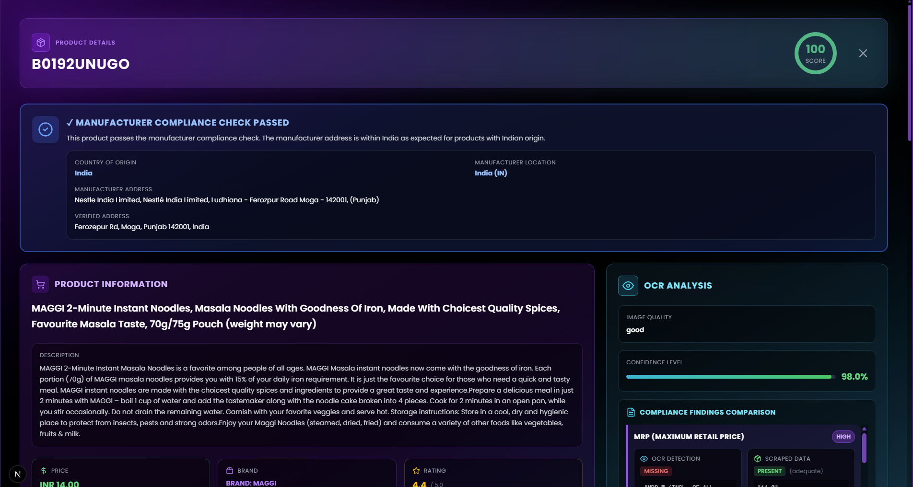
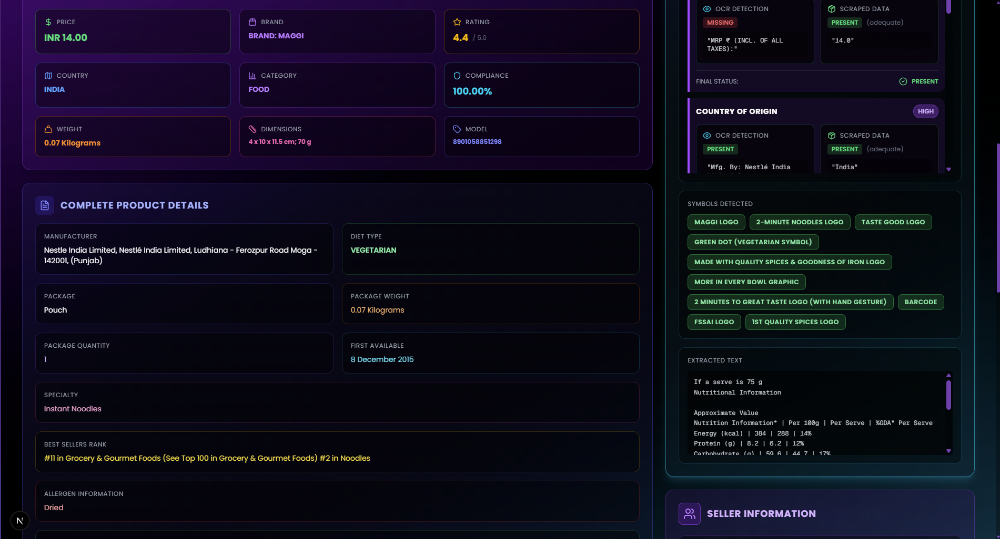
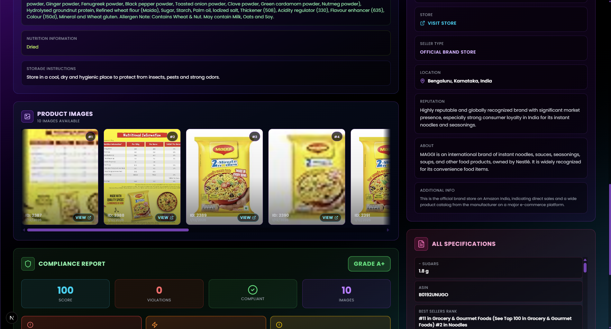
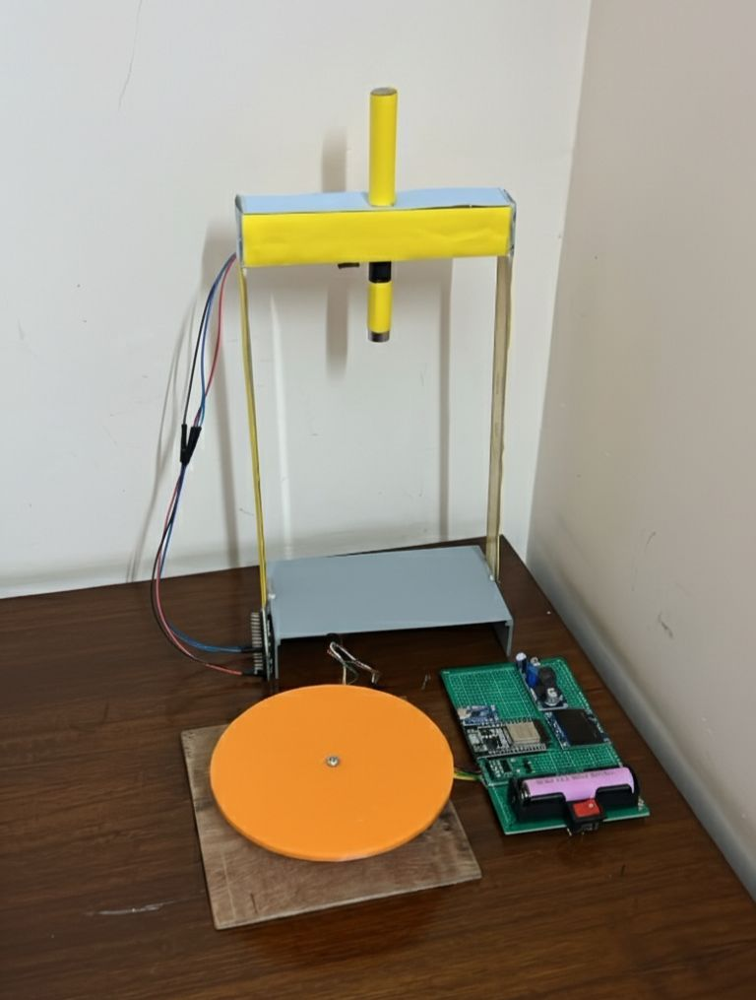

# 🏷️ MetaMark

## AI-Driven Automated Legal Metrology Compliance Checker

**Smart India Hackathon 2025 – Winning Solution**
**Team Code Nirvana**

---

## 📌 Overview

**MetaMark** is an **AI-driven, hardware-assisted compliance verification system** designed to automatically validate **Legal Metrology declarations on e-commerce platforms**.

The platform combines **Vision AI, Large Language Model (LLM) reasoning, cloud-native microservices, and IoT-based physical verification hardware** to detect misleading packaging, incorrect declarations, and regulatory violations **before products are published on marketplaces**.

> 🏛️ **Problem Statement ID:** SIH25057
> 🏢 **Ministry:** Consumer Affairs, Food & Public Distribution
> 🧠 **Theme:** Miscellaneous
> ⚙️ **Category:** Hardware

---

## 🎯 Problem Statement

E-commerce platforms face persistent challenges such as:

* Incorrect or missing declarations (MRP, quantity, origin, expiry)
* Fake labels, overwritten MRPs, and misleading packaging
* Manual audits that are slow, expensive, and error-prone
* Lack of real-time, audit-ready compliance visibility
* Limited physical verification of listed products

**MetaMark addresses these challenges by automating compliance enforcement using AI-based reasoning and sensor-driven physical validation.**

---

## 💡 Solution Summary

MetaMark delivers an **end-to-end automated compliance pipeline** that provides:

* Automated extraction of legal declarations from product images
* AI-driven validation against Legal Metrology rules
* Confidence-weighted compliance scoring
* Auto-generated violation explanations and remediation steps
* Hardware-assisted physical verification of product attributes
* Transparent, audit-ready compliance reports

---

## 🧠 High-Level Architecture

```
E-Commerce Listing
       │
       ▼
Image + Metadata Input
       │
       ▼
Vision AI (OCR + Object Detection)
       │
       ▼
Gemini LLM Compliance Engine
       │
       ▼
Compliance Score + Violations
       │
       ▼
Pre-Upload Validation / Audit Engine
       │
       ▼
Dashboard, Reports & Heatmaps
```

---

## ✨ Key Features

### 🔍 AI-Based Label & Declaration Analysis

* Multilingual OCR using **Google Vision**
* Object detection for packaging types (bottles, packets, containers)
* Automatic extraction of **25+ legal attributes**, including:

  * MRP
  * Net quantity
  * Manufacturer details
  * Country of origin
  * Expiry and batch information

---

### 🧠 LLM-Powered Compliance Reasoning

* Uses **Gemini 2.0** for:

  * Legal rule interpretation
  * Violation reasoning
  * Context-aware remediation suggestions
* Automatically adapts to **updated Legal Metrology regulations**
* Eliminates dependency on hard-coded rule engines

---

### 📊 Confidence-Weighted Compliance Scoring

* Final compliance score is computed using:

  * OCR confidence
  * Semantic accuracy of extracted data
* Outputs:

  * Compliance grades (A+, A, B, etc.)
  * Detailed violation breakdown
  * Explanation-backed decision trail

---

### 🚦 Pre-Upload Validation Engine

* Validates listings **before they go live**
* Reduces:

  * Delisting costs
  * Manual review overhead
* Provides sellers with **readiness scores and fix suggestions**

---

### 🌍 Real-Time Compliance Heatmap

* Tracks compliance trends across:

  * Manufacturers
  * Importers
  * Packers
* Identifies:

  * Repeat violators
  * High-risk entities
  * Systemic compliance gaps

---

## ⚙️ Technical Architecture

### 🧩 Software Stack

| Layer        | Technologies                     |
| ------------ | -------------------------------- |
| Frontend     | React, Next                      |
| Backend      | Flask (Microservices)            |
| AI           | Google Vision OCR, Gemini 2.0    |
| Web Crawling | Selenium, BeautifulSoup          |
| Database     | MySQL                            |
| Cloud        | AWS / GCP, S3                    |
| Analytics    | Python (Statistical Aggregation) |

---

### 🔄 AI Processing Pipeline

1. **Dynamic Web Crawler**

   * Extracts live e-commerce listings and metadata
2. **Vision AI OCR**

   * Extracts textual and visual label information
3. **LLM Compliance Engine**

   * Validates data against legal metrology rules
4. **Auto-Remediation Engine**

   * Maps violations to actionable fixes
5. **Scoring & Reporting**

   * Generates explainable, audit-ready reports

---

## 🧪 Hardware Innovation (Key Differentiator)

MetaMark uniquely integrates **sensor-based physical verification** with AI-driven digital compliance.

### 🔩 Hardware Components

| Module            | Purpose                                     |
| ----------------- | ------------------------------------------- |
| TOF Sensor        | Measures real-world package dimensions      |
| Load Cell + HX711 | Accurate weight verification                |
| UV + IR Scanner   | Detects fake labels, overwrites & tampering |
| ESP32 + BLE       | Low-power wireless communication            |

---

### 📦 Hardware Capabilities

* Detects **under-filled or adulterated products**
* Identifies **fake holograms, expiry reprints, and MRP tampering**
* Verifies **declared vs actual weight and volume**
* Portable, **mobile-mountable modular architecture**
* Low-cost, scalable, and manufacturable design

---

## 🖼️ Screenshots & Prototype

### 🔹 Compliance Dashboard


### 🔹 AI Compliance Analysis





### 🔹 Hardware Prototype (Sensor-Based Verification)



---

## 🪙 Meta-Token Reward System (User Incentive & Engagement)

MetaMark includes a **Meta-Token–based reward mechanism** to drive **user engagement, adoption, and retention**.

### 🔁 Process & Concept

* **Meta-Tokens (MT)** are MetaMark’s **native reward exchange tokens**
* Users earn MT tokens when they:

  1. Generate a **compliance report**
  2. Access **affiliate links** to partner e-commerce platforms
  3. Successfully purchase products via those links
* Tokens earned are **proportional to product value**

---

### 🎁 Token Collection & Redemption

* Meta-Tokens can be:

  * Accumulated over time
  * Redeemed for **real-balance gift cards** on e-commerce platforms
* Tokens are redeemable in **fixed slabs**:

  * `10 MT`
  * `20 MT`
  * `90 MT`
* Fixed tiers:

  * Encourage faster redemption
  * Increase repeat engagement

---

### 🚀 Platform Benefits

* Boosts repeat usage and referrals
* Improves compliance-aware purchasing behavior
* Increases user trust and platform engagement
* Creates a sustainable incentive loop

---

## 📚 Demo 

* 🎥 **Live Demo:** [https://youtu.be/xZJdHqtpcVk](https://youtu.be/xZJdHqtpcVk)

---

## 👨‍💻 Team

**Team Code Nirvana**
Smart India Hackathon 2025

---

